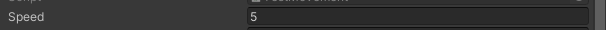
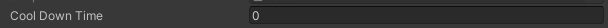

*Was Written on February 2022
*May or may not reflect on the current set up of the Character System


# Hero's Journey
Don't be a Hero, create the hero. Doesn't make sense but after this... you still won't understand it. If you heard of this then you've heard the 3Cs.
- Chance
- Change
- Choice

What's my point? I don't know. Just continue reading.

To understand the hero, we must first understand what he is in this play called "Game". 

## Actor and Actions
The Hero is an Actor before anything else. He has properties that dictate what he is. Regardless of what they are, they are bind to him and are always there to tell him he has something, in himself, to describe about his role in the story. 

``` c#
public interface IActor
{
    public T GetProperty<T>() where T : IActorProperty;
    public T[] GetProperties<T>() where T : IActorProperty;
}

public interface IActorProperty
{
    IActor owner { get; }
}

public class Actor : MonoBehaviour, IActor
{
    // Gets properties within Game Object and in its children.
    protected virtual void Awake();
    
    // To Add Properties internally
    protected void AddProperty(params IActorProperty[] actorProperties); 

    // To Remove Properties internally
    protected void RemoveProperty(params IActorProperty[] actorProperties);

    // Gets property
    public T GetProperty<T>() where T : IActorProperty;

    public T[] GetProperties<T>() where T : IActorProperty;
}
```

In his job as an Actor, he also has to do actions that add flare and supports his properties however his actions are, too, his properties. His Actions are able to tell the Actor if it is Active and has an end. The question lies with how it starts but the story will reveal later how he is able to do his actions on stage.

``` c#
public interface IActorAction : IActorProperty
{
    bool isActive { get; }

    void End();
}

public abstract class ActorAction : MonoBehaviour, IActorAction
{
    // If Action is Active
    public bool isActive { get; }

    // Owner of the Action
    public virtual IActor owner { get; }

    // Finds the owner in the game object.
    protected virtual void Awake();

    // Activates Action internally
    protected virtual void Begin();

    // Deactivates Action
    public virtual void End();
}
```

Admittedly he is empty, a mere skeleton to what he can be however with a solid foundation he can be something great. So to spice up his story, we add to him his Character. Nameless it he may be but it is a start to his story.

## Character
As a Character, he can move around, look at any direction, and, of course, has health to add some drama. 

### Actions
He is given actions that give him simple actions that make him interesting ever so slightly however that little bit of detail will take him wonders, to experience the world and interact with it.

Restrictable Action

#### Movement

#### Orientation

### Property

#### Health

### Effectable
This world is not so kind. He also has to be careful he is also susceptible to effects that may come his way. There are effects that may empower him or restrain him to other Characters in this story.


## Hero
- In this current world, there are only Heroes and enemies. There are 
- A hero is a Character that has Mana, Skill, Ultimate and Passive Effects. 
- Create a game object
- add the hero class (you can use the test hero class for inputs)

### Action

#### Attack
public interface IAttackAction : ICoolDownAction, IUseAction, ICanUseAction
{
    int damage { get; }
    float range { get; }
    float speed { get; }
}

#### Skill
#### Ultimate

### Property
#### Mana

# Gearing Up
The question remains who the hero is that the Actor is going to play as. We don't know and neither does he. The Hero is made not born. As such he will change throughout this story.

We will now talk in technical terms. Why only now? Shut up, I was in the mood for theatrics.

Of course, you can use the Test Scripts as substitutes while the development of other Actions are in order.

## Hero
First Create a Gameobject and then add your Hero Class.

The Hero Class is already set up with the systems created for it so you can plug it in unless you want some features for your specific Hero (But you have to read the Hero’s Journey to understand what their foundations are). I recommend adding the Test Hero Class because it already has inputs already made into it (WASD, U, I, O).

  


Of course, set up the Max Health and Mana. The Current Health/Mana are just for debugging purposes. They are set to max health on Awake.

Passive Effects are automatically tracking actions and are processed so you only have to reference, at least, 1 in the list but don't leave it as empty. 

## Action
These are the classic Actions of any character. These actions are UseActions and RestrictableAction. 

The Use part usually should be called in the awake function, unless there’s it's going be called remotely, to activate them though do call the base.Awake() function. 

``` c#
protected override void Awake()
{
    base.Awake();

    Use();
}
```

The Restrictable part is already being handled so you don’t have to worry about it. 

## Movement
The Movement Class requires 2 properties that need to be defined. The moveSpeed and velocity.

``` c#
public class test : Movement
{
    public override Vector2 velocity => throw new System.NotImplementedException();
}
```

I left it like that to be customizable to your needs. Where do I use it? I don’t know either XD But I know we’ll need it somewhere soon and Juwan said it so yeah.

Now, of course, how do we determine where we want to go and how fast we are going?

For the speed, you can use the speed property I already set. It is serialized in the base class.

  

``` c#
public class Movement : ...
{
    [SerializeField]
    float _Speed;

    public float speed => _Speed;
}
```

For the Direction, you need to override the Move Function however you need to keep track of “isActive” and “isRestricted” as the movement inherits from the ActorAction and IRestrainableAction.

``` c#
public override bool Move(Vector2 direction)
{
    bool canMove = isActive && isRestricted; // You can also use the base.Move(direction) since it also returns the results
    
    if(canMove)
        _Direction = direction;

    return canMove;
}
```

Those are the 2 things you need to get the velocity. Now you can create a Fixed Update function and put everything in there. 

``` c#
public class Test : Movement
{
    Vector2 _Velocity;
    Vector2 _Direction;
    
    public override Vector2 velocity => _Velocity;

    protected override void Awake()
    {
        base.Awake();

        Use();
    }

    void FixedUpdate()
    {
        if(isActive && !isRestricted)
        {
            _Velocity = _Direction * speed * Time.fixedDeltaTime;

            transform.position += (Vector3)_Velocity;
        }
    }

    public override bool Move(Vector2 direction)
    {
        bool canMove = isActive && !isRestricted; // You can also use the base.Move(direction) since it also returns the results
        
        if(canMove)
            _Direction = direction;

        return canMove;
    }
}
```

## Orientation
Like the Movement Action, the process is similar. So first you’ll need to define the currentOrientation.

``` c#
public class Test : Orientation
{
    public override Vector2Int currentOrientation => throw new System.NotImplementedException();
}
```

Afterwards, override the Orientate function to get the orientation the player wants.

``` c#
public override bool Orientate(Vector2Int orientation)
{
    bool canOrientate = isActive && !isRestricted; // You can also use the base.Orientate(orientation) since it also returns the results

    if(canOrientate)
        _CurrentOrientation = orientation;

    return canOrientate;
}
```
Of course since our game is a 2D Game and turning is instantaneous (so far) as we just flip the sprite, we need to reference the Sprite Renderer. In our Orientate(...) function, we can do our flipping there.

``` c#
[RequireComponent(typeof(SpriteRenderer))]
public class Test : Orientation
{
    Vector2Int _CurrentOrientation;

    SpriteRenderer _SpriteRenderer;

    public override Vector2Int currentOrientation => _CurrentOrientation;

    protected override void Awake()
    {
        base.Awake();

        Use();

        _SpriteRenderer = GetComponent<SpriteRenderer>();s
    }

    public override bool Orientate(Vector2Int orientation)
    {
        bool canOrientate = isActive && !isRestricted; // You can also use the base.Orientate(orientation) since it also returns the results

        if(canOrientate)
        {
            _CurrentOrientation = orientation;

            _SpriteRenderer.flipX = orientation.x == 0 ? _SpriteRenderer.flipX : !(Mathf.Sign(orientation.x) == 1);
        }

        return canOrientate;
    }
}
```

## Cool Down Action
We now deal with the weird ones. Now these actions have cooldowns so by default (my setup) the cooldown starts automatically whenever the End() function is called. As the "Cool Down Action" you need to input the time for cooldown.

  

Of course, we use these actions to affect other Characters so I made some utilities and method extensions to help you with getting the characters (assuming everything was inheriting from my scripts).

``` c#
public static class Utilities
{
    public static Tuple<T, float>[] GetCharactersAndDistances<T>(Vector3 center, float radius, params Character[] exceptCharacters) where T : Character;
    
    public static T[] GetCharacters<T>(Vector3 center, float radius, params Character[] exceptCharacters) where T : Character;

    public static T GetNearestCharacter<T>(Vector3 center, float radius, params Character[] exceptCharacters) where T : Character;
}

public static class MethodExtensions
{
    public static T FaceNearestCharacter<T>(this Character character, float radius) where T : Character;
    
    public static void FaceNearestCharacter(this Character character, Character target);

    public static Character FaceNearestCharacter(this Character characterBase, float radius);
    
    ...
}
```

Lastly, you have to access these actions’ character. If you inherited from my scripts as well as the Hero and don’t forget to add the component into the same game object as the Hero script. You can simply call “owner” to get the reference of your character though you will have to cast him.

``` c#
Hero _Hero;

protected override void Awake()
{
    base.Awake();

    _Hero = owner as Hero;
}
```

## Attack
Firstly, of course, inherit from the Attack class. The attack's damage, range, speed and manaGainOnHit(?) is already laid out and can be accessed through the prepared properties

  

>Note: You have to use them for it be of use.

Afterwards, we’re going to use the Base.Use() function to get the result opposite of isActive and isRestricted as well as active the action if ever it returns true. 

Now use the result and reference it in a bool variable. Check if it is true and now you can add your code. In this example I’m going to start a coroutine.

``` c#
public class Test : Attack
{
    Hero _Hero;

    protected override void Awake()
    {
        base.Awake();

        _Hero = owner as Hero;
    }

    IEnumerator Tick()
    {
        yield return new WaitForSeconds(2);

        End();
    }

    public override bool Use()
    {
        bool canUse = base.Use(); // This time do use it since I also active the attack behind the scenes;

        if(canUse)
            StartCoroutine(End());

        return canUse;
    }
}
```

If you’ll notice, I called the end function. You will have to call when the attack ends as normally nothing can remotely end an action unless in certain situations. So you have to consider those situations.

``` c#
public class Test : Attack
{
    Hero _Hero;

    Coroutine _TickCoroutine;

    protected override void Awake()
    {
        base.Awake();

        _Hero = owner as Hero;
    }

    IEnumerator Tick()
    {
        yield return new WaitForSeconds(2);

        End();
    }

    public override bool Use()
    {
        bool canUse = base.Use(); // This time do use it since I also active the attack behind the scenes;

        if(canUse)
            _TickCoroutine = StartCoroutine(End());

        return canUse;
    }

    public override void End()
    {
        base.End();

        if(_TickCoroutine != null)
            StopCoroutine(_TickCoroutine);
    }
}
```

## Skill
The process of setting up the skill script is also similar to the attack script. Actually all 3 of them are similar.

So yeah, set up the Use function, where your Skill ends and you’ve done it!

``` c#
public class Test : Skill
{
    Coroutine _TickCoroutine;
    
    Hero _Hero;

    protected override void Awake()
    {
        base.Awake();

        _Hero = owner as Hero;
    }

    IEnumerator Tick()
    {
        yield return new WaitForSeconds(2);

        End();
    }

    public override bool Use()
    {
        bool canUse = base.Use();

        if(canUse)
            _TickCoroutine = StartCoroutine(Tick());

        return canUse;
    }

    public override void End()
    {
        base.End();

        if(_TickCoroutine != null)
            StopCoroutine(_TickCoroutine);
    }
}
```

## Ultimate
Now the Ultimate... Dun dun dun... Well still the same honestly except you have to input the Mana cost.

  

With that, I literally copy the skill script, just like I copy pasted the attack script, edit a little bit and done BUT WAIT, we have to adjust the Use function to check if the hero has enough mana and to use it if he has!

``` c#
public override bool Use()
{
    bool canUse = _Hero.mana.currentMana >= manaCost && base.Use(); // I check first if he has enough mana since if it returns false, the base.Use() won't be called

    if(canUse)
    {
        _Hero.UseMana(manaCost);

        _TickCoroutine = StartCoroutine(Tick());
    }

    return canUse;
}
```

``` c#
public class Test : Ultimate
{
    Coroutine _TickCoroutine;
    
    Hero _Hero;

    protected override void Awake()
    {
        base.Awake();

        _Hero = owner as Hero;
    }

    IEnumerator Tick()
    {
        yield return new WaitForSeconds(2);

        End();
    }

    public override bool Use()
    {
        bool canUse = _Hero.mana.currentMana >= manaCost && base.Use(); // I check first if he has enough mana since if it returns false, the base.Use() won't be called

        if(canUse)
        {
            _Hero.UseMana(manaCost);

            _TickCoroutine = StartCoroutine(Tick());
        }

        return canUse;
    }

    public override void End()
    {
        base.End();

        if(_TickCoroutine != null)
            StopCoroutine(_TickCoroutine);
    }
}
```

## In Action
Of course, those are dandy on how they are setup but what about their use case?

well here it is. I'll only show the Tick Coroutine. 

``` c#
IEnumerator Tick()
{
    Enemy enemy = _Hero.FaceNearestCharacter<Enemy>(range);

    yield return new WaitForSeconds(0.1f);

    enemy.health.Damage(damage); // Based on Attack but I hope you get the point of it. 

    End();
}
```

Obviously, this is super simple and may not be of any use but its the concept that matters. Afterall, I have no idea what abilities/sequences/etc are going to be made so this is mostly a framework if you will. A relatively large framework. So yeah, cheers and do ask me if you have any questions (I know there will be afterall I suck at explaining and btw this document took a week to be made and I'm not even done writing this [at the time of writing])