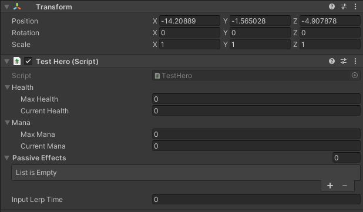

** Was Written on February 2022 ** 
** May or may not reflect on the current set up of the Character System **


# Hero's Journey
Don't be a Hero, create the hero. Doesn't make sense but after this... you still won't understand it. If you heard of this then you've heard the 3Cs.
- Chance
- Change
- Choice

What's my point? I don't know. Just continue reading.

## Character
To understand the hero, we must first understand what he is in this play called "Game". 

### Actor and Actions
The Hero is an Actor before anything else. He has properties that dictate what he is. Regardless of what they are, they are bind to him and are always there to tell him he has something, in himself, to describe about his role in the story. 

``` c#
public interface IActor
{
    public T GetProperty<T>() where T : IActorProperty;
    public T[] GetProperties<T>() where T : IActorProperty;
}

public interface IActorProperty
{
    IActor owner { get; }
}

public class Actor : MonoBehaviour, IActor
{
    // Gets properties within Game Object and in its children.
    protected virtual void Awake();
    
    // To Add Properties internally
    protected void AddProperty(params IActorProperty[] actorProperties); 

    // To Remove Properties internally
    protected void RemoveProperty(params IActorProperty[] actorProperties);

    // Gets property
    public T GetProperty<T>() where T : IActorProperty;

    public T[] GetProperties<T>() where T : IActorProperty;
}
```

In his job as an Actor, he also has to do actions that add flare and supports his properties however his actions are, too, his properties. His Actions are able to tell the Actor if it is Active and has an end. The question lies with how it starts but the story will reveal later how he is able to do his actions on stage.

``` c#
public interface IActorAction : IActorProperty
{
    bool isActive { get; }

    void End();
}

public abstract class ActorAction : MonoBehaviour, IActorAction
{
    // If Action is Active
    public bool isActive { get; }

    // Owner of the Action
    public virtual IActor owner { get; }

    // Finds the owner in the game object.
    protected virtual void Awake();

    // Activates Action internally
    protected virtual void Begin();

    // Deactivates Action
    public virtual void End();
}
```

Admittedly he is empty, a mere skeleton to what he can be however with a solid foundation he can be something great. So to spice up his story, we add to him his Character. Nameless it he may be but it is a start to his story.

### Character
As a Character, he can move around, look at any direction, and, of course, has health to add some drama. 

### Actions
He is given actions that give him simple actions that make him interesting ever so slightly however that little bit of detail will take him wonders, to experience the world and interact with it.

``` c#
public interface IToggleAction : IActorAction
{
    void ToggleAction(bool isActive);
}

public interface IRestrictableAction : IActorAction
{
    bool isRestricted { get; }
    void OnRestrict(RestrictActionType restrictActions);
}
```

#### Movement
public interface IMovementAction : IActorAction, IToggleAction, IRestrictableAction
{
    Vector2 velocity { get; }

    bool Move(Vector2 direction);
}

#### Orientation
public interface IOrientationAction : IActorAction, IToggleAction, IRestrictableAction
{
    Vector2Int currentOrientation { get; }

    // Direction
    /// <summary>
    /// Orients the Character to the direction.
    /// </summary>
    /// <param name="orientation"></param>
    bool Orientate(Vector2Int orientation);
}

### Property
#### Health

### Effectable
This world is not so kind. He also has to be careful he is also susceptible to effects that may come his way. There are effects that may empower him or restrain him to other Characters in this story.

### Restrictable Action


## Hero
- In this current world, there are only Heroes and enemies. There are 
- A hero is a Character that has Mana, Skill, Ultimate and Passive Effects. 
- Create a game object
- add the hero class (you can use the test hero class for inputs)

#### Attack
public interface IAttackAction : ICoolDownAction, IUseAction, ICanUseAction
{
    int damage { get; }
    float range { get; }
    float speed { get; }
}

## Skill
## Ultimate

# How To Set Up A Hero
The question remains who the hero is that the Actor is going to play as. We don't know and neither does he. The Hero is made is made not born. As such he will change throughout this story.

We will now talk in technical terms. Why only now? Shut up, I was in the mood for theatrics.

First Create a Gameobject and then add your Hero Class.

## Hero
The Hero Class is already setup with the systems created for it. You can inherit from it to create more features if you need to. There is also a Test Hero Class that has the inputs already made into it.


## Movement
## Orientation
## Attack
## Skill
## Ultimate