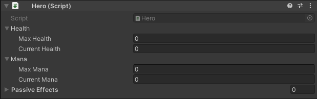

*Was Written on February 2022
*May or may not reflect on the current set up of the Character System


# Hero's Journey
Don't be a Hero, create the hero. Doesn't make sense but after this... you still won't understand it. If you heard of this then you've heard the 3Cs.
- Chance
- Change
- Choice

What's my point? I don't know. Just continue reading.

To understand the hero, we must first understand what he is in this play called "Game". 

## Actor and Actions
The Hero is an Actor before anything else. He has properties that dictate what he is. Regardless of what they are, they are bind to him and are always there to tell him he has something, in himself, to describe about his role in the story. 

``` c#
public interface IActor
{
    public T GetProperty<T>() where T : IActorProperty;
    public T[] GetProperties<T>() where T : IActorProperty;
}

public interface IActorProperty
{
    IActor owner { get; }
}

public class Actor : MonoBehaviour, IActor
{
    // Gets properties within Game Object and in its children.
    protected virtual void Awake();
    
    // To Add Properties internally
    protected void AddProperty(params IActorProperty[] actorProperties); 

    // To Remove Properties internally
    protected void RemoveProperty(params IActorProperty[] actorProperties);

    // Gets property
    public T GetProperty<T>() where T : IActorProperty;

    public T[] GetProperties<T>() where T : IActorProperty;
}
```

In his job as an Actor, he also has to do actions that add flare and supports his properties however his actions are, too, his properties. His Actions are able to tell the Actor if it is Active and has an end. The question lies with how it starts but the story will reveal later how he is able to do his actions on stage.

``` c#
public interface IActorAction : IActorProperty
{
    bool isActive { get; }

    void End();
}

public abstract class ActorAction : MonoBehaviour, IActorAction
{
    // If Action is Active
    public bool isActive { get; }

    // Owner of the Action
    public virtual IActor owner { get; }

    // Finds the owner during the call of the Awake function in the game object.
    protected virtual void Awake();

    // Activates Action internally
    protected virtual void Begin();

    // Deactivates Action
    public virtual void End();
}
```

Admittedly he is empty, a mere skeleton to what he can be however with a solid foundation he can be something great. So to spice up his story, we add to him his Character. Nameless it he may be but it is a start to his story.

## Character
As a Character, he can move around, look at any direction, and, of course, has health to add some drama. He is also affected by effects.

``` c#
public class Character : Actor, ICharacterActor
{
    public IHealth health { get; }

    public IMovementAction movement { get; }

    public IOrientationAction orientation { get; }

    public RestrictActionType restrictedActions { get; }

    public IEffect[] effects { get; }
    public event Action<IEffect[]> onAddEffectsEvent;
    public event Action<IEffect[]> onRemoveEffectsEvent;

    public static Character[] characters { get; }
    
    // Adds the Health, Movement, Orientation to his properties, lists down the restrictable Actions and subscribes on Add/Remove effects
    protected override void Awake();

    public void AddEffects(IEffectable sender, params IEffect[] effects);

    public void RemoveEffects(params IEffect[] effects);

    public void AddRestrictable(params IRestrictableAction[] restrictableActions);

    public void RemoveRestrictable(params IRestrictableAction[] restrictableActions);
}
```

### Actions
He is given actions that give him simple actions that make him interesting ever so slightly however that little bit of detail will go a long way, to experience the world and interact with it.

To answer the question of how the Actor, as a Character, could use his Actions, here is the answer.

``` c#
public interface IUseAction : IActorAction
{
    bool Use();
}
``` 

He now can simply `Use` it but there's a condition to it as some actions can be used in that moment and some can't for reasons that are yet to be defined.

### Restrictable Action
Actions are not all powerful. These actions can be restricted and stop the Actor from using it.

``` c#
 public interface IRestrictableAction : IActorAction
{
    bool isRestricted { get; }
    void OnRestrict(RestrictActionType restrictActions);
}
```

Being the character, the Actor will have to be the one that keeps track of it. It may not be fun for him however it makes him interesting and develops features that turn him into something more.

``` c#
public interface IRestrictableActionsHandler
{
    RestrictActionType restrictedActions { get; }
    void AddRestrictable(params IRestrictableAction[] restrictableActions);
    void RemoveRestrictable(params IRestrictableAction[] restrictableActions);
}
```

The action could be stopped by effects or other things that may or may not be made onto the stage.

``` c#
public interface IActionRestricter
{
    RestrictActionType restrictAction { get; }
}
```

#### Movement
The Movement of the Character yet to be define as we are all unique and therefore many things could be done in different ways.

``` c#
public interface IMovementAction : IActorAction, IUseAction, IRestrictableAction
{
    float speed { get; }
    Vector2 velocity { get; }

    bool Move(Vector2 direction);
}

public abstract class Movement : ActorAction, IMovementAction
{
    public float speed { get; }

    public abstract Vector2 velocity { get; }

    public bool isRestricted { get; }

    public virtual bool Move(Vector2 direction);

    public virtual void OnRestrict(RestrictActionType restrictActions);

    public virtual bool Use();
}
```

#### Orientation
Orientation is where the Actor will look, and how.

``` c#
public interface IOrientationAction : IActorAction, IUseAction, IRestrictableAction
{
    Vector2Int currentOrientation { get; }

    bool Orientate(Vector2Int orientation);
}


public abstract class Orientation : ActorAction, IOrientationAction
{
    public bool isRestricted => _IsRestricted;

    public abstract Vector2Int currentOrientation { get; }

    public virtual bool Orientate(Vector2Int orientation);

    public virtual void OnRestrict(RestrictActionType restrictActions);

    public virtual bool Use();
}
```

### Property
Now here we add the drama of it all, well sometimes.

#### Health
The Health is what makes the Actor, as the character, by definition alive. Without this, he is merely a walking corpse.

``` c#
public interface IHealth
{
    int maxHealth { get; }
    int currentHealth { get; }
    bool isAlive { get; }

    event Action<IHealth, int> onAddHealthEvent;
    event Action<IHealth, int> onDamageEvent;
    event Action onKillEvent;
    event Action onResetHealthEvent;

    void AddHealth(int addHealth);

    void Damage(int damage);
    void Kill();
    void ResetHealth();
}

public class Health : IHealth, IActorProperty
{
    public event Action<IHealth, int> onAddHealthEvent;
    public event Action<IHealth, int> onDamageEvent;
    public event Action onKillEvent;
    public event Action onResetHealthEvent;

    public int maxHealth { get; }
    public int currentHealth { get; }
    public bool isAlive { get; }
    public IActor owner { get; set; }
    
    public void AddHealth(int addHealth);
    public void Damage(int damage);
    public void Kill();
    public void ResetHealth();
}
```

### Effectable
This world is not so kind. He also has to be careful he is also susceptible to effects that may come his way. There are effects that may empower him or restrain him to other Characters in this story.

``` c#
public interface IEffectable
{
    IEffect[] effects { get; }
    event Action<IEffect[]> onAddEffectsEvent;
    event Action<IEffect[]> onRemoveEffectsEvent;
    void AddEffects(IEffectable sender, params IEffect[] effects);
    void RemoveEffects(params IEffect[] effects);
}
```

### Effects
The things the Actor has too think of too are the effects. They may come from actions or things around them but are yet be known.

The effects are first and foremost can be copied from each other. They can multiply and clone from each other but are all one and the same by their instance.

``` c#
public interface ICloneable
{
    int instanceId { get; }
    bool isClone { get; }
    T CreateClone<T>() where T : ICloneable;
}
```

The effects that are constant with each other, besides them being clones, are that there's always a sender, who/what sent that effect and the receiver, who/what receives that effect. It can also start their start and end by the time it receives to their receivers. 

``` c#
public interface IEffect : ICloneable
{
    IEffectable sender { get; }
    IEffectable receiver { get; }

    void StartEffect(IEffectable sender, IEffectable receiver);
    void End();
}

public abstract class Effect : MonoBehaviour, IEffect
{s
    public IEffectable sender => _Sender;
    public IEffectable receiver => _Receiver;
    public bool isClone => _IsClone;
    public int instanceId => _InstanceId;

    public virtual void StartEffect(IEffectable sender, IEffectable receiver);

    public abstract void End();

    public T CreateClone<T>() where T : ICloneable;
}
```

As Effects can be clones, there is also the option of stacking them.

``` c#
public interface IStackableEffect : IEffect
{
    void Stack(params IEffect[] effects);
}
```

In this world, there are 2 kind of effects. The Active Effect and Passive Effect.

### Active Effects
Active effects are for all the Characters in this world, or until another being shows into the stage. They can restrict you but some may not. It can be used for evil purposes while others for good. It is a mere tool, and as such be defined by whoever or whatever uses them.

``` c#
public interface IActionRestricter
{
    RestrictActionType restrictAction { get; }
}

public interface IActiveEffect : IEffect, IActionRestricter
{

}

public abstract class ActiveEffect : Effect, IActiveEffect
{
    public RestrictActionType restrictAction { get; }

    public override void End();
}
```

### Passive Effects
The passive effects are for the Heroes of this stage. They have eyes that track their actions and do according to their will.

``` c#
public interface IActionTracker
{
    TrackActionType trackAction { get; }
}

public interface IPassiveEffect : IEffect, IActionTracker
{
    bool CanUse(Hero hero);
}

public abstract class PassiveEffect : Effect, IPassiveEffect
{
    public TrackActionType trackAction { get; }

    public abstract bool CanUse(Hero hero);
    
    public override void End();
}
```

## Hero
In this current world, there are only Heroes and enemies. Heroes that stand up against the enemies. The enemies are unkown as this stage has only begun. A hero is a Character that has Mana, Attack, Skill, Ultimate and Passive Effects. 

### Cool Down Action
Actions such as  Attack, Skill, Ultimate may be too powerful for the stage as such requires a bit of time before being used. 

``` c#
public interface ICoolDownAction : IActorAction
{
    float coolDownTime { get; }
    float currentCoolDownTime { get; }
    bool isCoolingDown { get; }

    void StartCoolDown();
    void StopCoolDown();
}

public abstract class CoolDownAction : ActorAction, ICoolDownAction
{
    public float coolDownTime { get; }
    
    public float currentCoolDownTime { get; }

    public bool isCoolingDown { get; }

    protected virtual IEnumerator CoolDown();

    public override void End();

    public virtual void StartCoolDown();

    public virtual void StopCoolDown();
}
```

### Trackable Action
Before talking about the exciting actions the Hero has, we must talk about why it is also tracked. Surprised? I'm guessing you're not but let my bravado fly. The actions are tracked so the Hero's passive effects will move according to their will. They are what helps these effects tell that they are doing something and tells them that its interesting. Enticing them.

``` c#
public interface ITrackableAction : IActorAction
{
    event System.Action<TrackActionType> onActionEvent;
}
```

#### Attack
The attack of a Hero is powerful however it is a blank slate as like the skill and ultimate. It has the damage, the range, the speed, the Mana gain on hit (that I have no idea where to put) but all are mere floating items in a vaccum of space. Until the spark can expand the its features until it is someting to marvel at.

``` c#
public interface IAttackAction : ICoolDownAction, IUseAction, ITrackableAction, IRestrictableAction
{
    int damage { get; }
    float range { get; }
    float speed { get; }
    int manaGainOnHit { get; }
}

public abstract class Attack : CoolDownAction, IAttackAction
{
    public int damage => _Damage;
    public float range => _Range;
    public float speed => _Speed;
    public int manaGainOnHit => _ManaGainOnHit;
    public bool isRestricted => _IsRestricted;

    public event Action<TrackActionType> onActionEvent;

    protected virtual void OnActionEvent(TrackActionType trackAction);
    protected override void Begin();

    public virtual bool Use();
    public void OnRestrict(RestrictActionType restrictActions);
}
```

#### Skill
The skill helps the Actor a bit more through the journey he has to face. The attack is powerful but it has its limits. The skill helps bridge the gap between it and the last action the Actor, as a hero, in its arsenal.

``` c#
public interface ISkillAction : ICoolDownAction, IUseAction, ITrackableAction, IRestrictableAction
{

}

public abstract class Skill : CoolDownAction, ISkillAction
{
    bool _IsRestricted = false;

    public bool isRestricted => _IsRestricted;

    public event Action<TrackActionType> onActionEvent;

    protected virtual void OnActionEvent(TrackActionType trackAction);
    protected override void Begin();

    public virtual bool Use();
    public void OnRestrict(RestrictActionType restrictActions);
}
```

#### Ultimate
The Ultimate, in the arsenal of actions the Hero has, is the most powerful of all but it wouldn't be interesting if there were no drawbacks. The cost of using this action is `Mana`. The mana is the source of power in this stage but has only limited uses. One of it is the Ultimate.

``` c#
public interface IUltimateAction : ICoolDownAction, IUseAction, ITrackableAction, IRestrictableAction
{
    int manaCost { get; }
}
```
### Property
Lastly, to add to the property that makes the Hero attractive to the actor to play as is Mana.

#### Mana
The power of Mana, in the palm of his hand or so a quote tells. 

``` c#
public interface IMana
{ 
    int maxMana { get; }
    int currentMana { get; }

    event Action<IMana, int> onUseManaEvent;
    event Action<IMana, int> onAddManaEvent;
    event Action onDrainManaEvent;
    event Action onResetManaEvent;

    void AddMana(int mana);
    void UseMana(int mana);
    void ResetMana();
    void DrainMana();
}

public class Mana : IMana, IActorProperty
{
    public event Action<IMana, int> onUseManaEvent;
    public event Action<IMana, int> onAddManaEvent;
    public event Action onDrainManaEvent;
    public event Action onResetManaEvent;

    public int maxMana => _MaxMana;
    public int currentMana => _CurrentMana;
    public IActor owner { get; set; }

    public void AddMana(int mana);
    public void UseMana(int mana);
    public void ResetMana();
    public void DrainMana();
}
```

# Gearing Up
The question remains who the hero is that the Actor is going to play as. We don't know and neither does he. The Hero is made not born. As such he will change throughout this story.

We will now talk in technical terms. Why only now? Shut up, I was in the mood for theatrics.

Of course, you can use the Test Scripts as substitutes while the development of other Actions are in order.

## Hero
First Create a Gameobject and then add your Hero Class.

The Hero Class is already set up with the systems created for it so you can plug it in unless you want some features for your specific Hero (But you have to read the Hero’s Journey to understand what their foundations are). I recommend adding the Test Hero Class because it already has inputs already made into it (WASD, U, I, O).

  


Of course, set up the Max Health and Mana. The Current Health/Mana are just for debugging purposes. They are set to max health on Awake.

Passive Effects are automatically tracking actions and are processed so you only have to reference, at least, 1 in the list but don't leave it as empty. 

## Action
These are the classic Actions of any character. These actions are `IUseActions` and `IRestrictableAction`. 

The Use part usually should be called in the awake function, unless it's going be called remotely, so invoke them in the `base.Awake()` function. 

``` c#
protected override void Awake()
{
    base.Awake();

    Use();
}
```

The Restrictable part is already being handled so you don’t have to worry about it. Just check if it is restricted or not using the `isRestricted` property


## Movement
The Movement Class requires 1 properties that need to be defined and its the `velocity`.

``` c#
public class test : Movement
{
    public override Vector2 velocity => throw new System.NotImplementedException();
}
```

I left it like that to be customizable to your needs. Where do I use it? I don’t know either XD 

Now, of course, how do we determine where we want to go and how fast we are going?

For the speed, you can use the speed property I already set. It is serialized in the base class.

  

``` c#
public class Movement : ...
{
    [SerializeField]
    float _Speed;

    public float speed => _Speed;
}
```

For the Direction, you need to override the Move Function however you need to keep track of `isActive` and `isRestricted` as the movement inherits from the `ActorAction` and `IRestrainableAction`.

``` c#
public override bool Move(Vector2 direction)
{
    bool canMove = isActive && isRestricted; // You can also use the base.Move(direction) since it also returns the results
    
    if(canMove)
        _Direction = direction;

    return canMove;
}
```

Those are the 2 things you need to get the velocity. Now you can create a `FixedUpdate` function and put everything in there. 

``` c#
public class Test : Movement
{
    Vector2 _Velocity;
    Vector2 _Direction;
    
    public override Vector2 velocity => _Velocity;

    protected override void Awake()
    {
        base.Awake();

        Use();
    }

    void FixedUpdate()
    {
        if(isActive && !isRestricted)
        {
            _Velocity = _Direction * speed * Time.fixedDeltaTime;

            transform.position += (Vector3)_Velocity;
        }
    }

    public override bool Move(Vector2 direction)
    {
        bool canMove = isActive && !isRestricted; // You can also use the base.Move(direction) since it also returns the results
        
        if(canMove)
            _Direction = direction;

        return canMove;
    }
}
```

## Orientation
Like the Movement Action, the process is similar. So first you’ll need to define the `currentOrientation`.

``` c#
public class Test : Orientation
{
    Vector2Int _CurrentOrientation;
    public override Vector2Int currentOrientation => _CurrentOrientation;
}
```

Afterwards, override the `Orientate` function to get the orientation the player wants.

``` c#
public override bool Orientate(Vector2Int orientation)
{
    bool canOrientate = isActive && !isRestricted; // You can also use the base.Orientate(orientation) since it also returns the results

    if(canOrientate)
        _CurrentOrientation = orientation;

    return canOrientate;
}
```
Of course since our game is a 2D Game and turning is instantaneous (so far) as we just flip the sprite, we need to reference the `Sprite Renderer`. In our `Orientate(...)` function, we can do our flipping there.

``` c#
[RequireComponent(typeof(SpriteRenderer))]
public class Test : Orientation
{
    Vector2Int _CurrentOrientation;

    SpriteRenderer _SpriteRenderer;

    public override Vector2Int currentOrientation => _CurrentOrientation;

    protected override void Awake()
    {
        base.Awake();

        Use();

        _SpriteRenderer = GetComponent<SpriteRenderer>();s
    }

    public override bool Orientate(Vector2Int orientation)
    {
        bool canOrientate = isActive && !isRestricted; // You can also use the base.Orientate(orientation) since it also returns the results

        if(canOrientate)
        {
            _CurrentOrientation = orientation;

            _SpriteRenderer.flipX = orientation.x == 0 ? _SpriteRenderer.flipX : !(Mathf.Sign(orientation.x) == 1);
        }

        return canOrientate;
    }
}
```

## Cool Down Action
We now deal with the weird ones. Now these actions have cooldowns so by default (my setup) the cooldown starts automatically whenever the `End()` function is called. As the "Cool Down Action" you need to input the time for cooldown.

  

Of course, we use these actions to affect other Characters so I made some utilities and method extensions to help you with getting the characters (assuming everything was inheriting from my scripts).

``` c#
public static class Utilities
{
    public static Tuple<T, float>[] GetCharactersAndDistances<T>(Vector3 center, float radius, params Character[] exceptCharacters) where T : Character;
    
    public static T[] GetCharacters<T>(Vector3 center, float radius, params Character[] exceptCharacters) where T : Character;

    public static T GetNearestCharacter<T>(Vector3 center, float radius, params Character[] exceptCharacters) where T : Character;
}

public static class MethodExtensions
{
    public static T FaceNearestCharacter<T>(this Character character, float radius) where T : Character;
    
    public static void FaceNearestCharacter(this Character character, Character target);

    public static Character FaceNearestCharacter(this Character characterBase, float radius);
    
    ...
}
```

Lastly, you have to access these actions’ character. If you inherited from my scripts as well as the Hero and don’t forget to add the component into the same game object as the Hero script. You can simply call `owner` to get the reference of your character though you will have to cast him.

``` c#
Hero _Hero;

protected override void Awake()
{
    base.Awake();

    _Hero = owner as Hero;
}
```

## Attack
Firstly, of course, inherit from the Attack class. The attack's `damage`, `range`, `speed` and `manaGainOnHit`(?) is already laid out and can be accessed through the prepared properties

  

>Note: You have to use them for it be of use.

Afterwards, we’re going to use the `Base.Use()` function to activate the behind the scenes stuff like the tracking of the action.

Now use the result and reference it in a bool variable. Check if it is true and now you can add your code. In this example I’m going to start a coroutine.

``` c#
public class Test : Attack
{
    Hero _Hero;

    protected override void Awake()
    {
        base.Awake();

        _Hero = owner as Hero;
    }

    IEnumerator Tick()
    {
        yield return new WaitForSeconds(2);

        End();
    }

    public override bool Use()
    {
        bool canUse = base.Use();

        if(canUse)
            StartCoroutine(End());

        return canUse;
    }
}
```

If you’ll notice, I called the `End` function. You will have to call when the attack ends as normally nothing can remotely end an action unless in certain situations. So you have to consider those situations.

``` c#
public class Test : Attack
{
    Hero _Hero;

    Coroutine _TickCoroutine;

    protected override void Awake()
    {
        base.Awake();

        _Hero = owner as Hero;
    }

    IEnumerator Tick()
    {
        yield return new WaitForSeconds(2);

        End();
    }

    public override bool Use()
    {
        bool canUse = base.Use(); // This time do use it since I also active the attack behind the scenes;

        if(canUse)
            _TickCoroutine = StartCoroutine(End());

        return canUse;
    }

    public override void End()
    {
        base.End();

        if(_TickCoroutine != null)
            StopCoroutine(_TickCoroutine);
    }
}
```

## Skill
The process of setting up the skill script is also similar to the attack script. Actually all 3 of them are similar.

So yeah, set up the `Use` function, where your Skill ends and you’ve done it!

``` c#
public class Test : Skill
{
    Coroutine _TickCoroutine;
    
    Hero _Hero;

    protected override void Awake()
    {
        base.Awake();

        _Hero = owner as Hero;
    }

    IEnumerator Tick()
    {
        yield return new WaitForSeconds(2);

        End();
    }

    public override bool Use()
    {
        bool canUse = base.Use();

        if(canUse)
            _TickCoroutine = StartCoroutine(Tick());

        return canUse;
    }

    public override void End()
    {
        base.End();

        if(_TickCoroutine != null)
            StopCoroutine(_TickCoroutine);
    }
}
```

## Ultimate
Now the Ultimate... Dun dun dun... Well still the same honestly except you have to input the Mana cost.

  

With that, I literally copy the skill script, just like I copy pasted the attack script, edit a little bit and done. You might be asking if we should add if the Hero has Mana and you would be right. Do not worry as it is already set.

``` c#
public override bool Use()
{
    bool canUse = base.Use(); // I check first if he has enough mana since if it returns false, the base.Use() won't be called

    if(canUse)
    {
        _Hero.UseMana(manaCost);

        _TickCoroutine = StartCoroutine(Tick());
    }

    return canUse;
}
```

``` c#
public class Test : Ultimate
{
    Coroutine _TickCoroutine;
    
    Hero _Hero;

    protected override void Awake()
    {
        base.Awake();

        _Hero = owner as Hero;
    }

    IEnumerator Tick()
    {
        yield return new WaitForSeconds(2);

        End();
    }

    public override bool Use()
    {
        bool canUse = base.Use();

        if(canUse)
        {
            _Hero.UseMana(manaCost);

            _TickCoroutine = StartCoroutine(Tick());
        }

        return canUse;
    }

    public override void End()
    {
        base.End();

        if(_TickCoroutine != null)
            StopCoroutine(_TickCoroutine);
    }
}
```

## In Action
Of course, those are dandy on how they are setup but what about their use case?

well here it is. I'll only show the Tick Coroutine. 

``` c#
IEnumerator Tick()
{
    Enemy enemy = _Hero.FaceNearestCharacter<Enemy>(range);

    yield return new WaitForSeconds(0.1f);

    enemy.health.Damage(damage); // Based on Attack but I hope you get the point of it. 

    _Hero.mana.AddMana(manaGainOnHit);

    End();
}
```

Obviously, this is super simple and may not be of any use but its the concept that matters. Afterall, I have no idea what abilities/sequences/etc are going to be made so this is mostly a framework if you will. A relatively large framework. So yeah, cheers and do ask me if you have any questions (I know there will be afterall I suck at explaining and btw this document took a week to be made and I'm not even done writing this [at the time of writing])

## Effects
Fuck I forgot to write this part. Anyways The effects are designed to be things that affect the other characters without it being in direct reference to it. This time they are now prefabs instead of Scriptable Objects.

  

### Active Effects
To create an Active Effect, simply first inherit it and... nothing. There is nothing currently to define so that's good~

``` c#
public class Test : ActiveEffect
{
    
}
```

Of course, we have functions to tell when the effect has started and has ended.

``` c#
public override void StartEffect(IEffectable sender, IEffectable receiver)
{
    base.StartEffect(sender, receiver);
}

public override void End()
{
    base.End();
}
```

It is important that you keep the `base` functions. The start effect base function sets up the sender and receiver properties while the end is already set up to remove itself from the receiver. 

The `IEffectable` interface variables in the StartEffect function is currently the characters so you can cast them as such to access them.  

## Passive Effects
Passive effects are for the Heroes. The difference from the Active Effect from this one is that it tracks the actions of the Hero (Attack, Skill, and Ultimate). But its now(and I mean literally I just changed something) just the same as the Active Effect.

``` c#
public class Test : PassiveEffect
{
    public override void StartEffect(IEffectable sender, IEffectable receiver)
    {
        base.StartEffect(sender, receiver);
    }

    public override void End()
    {
        base.End();
    }
}
```

The difference visually is how it shows in the inspector.

  

  

>Note: Ignore the Active Effect field.